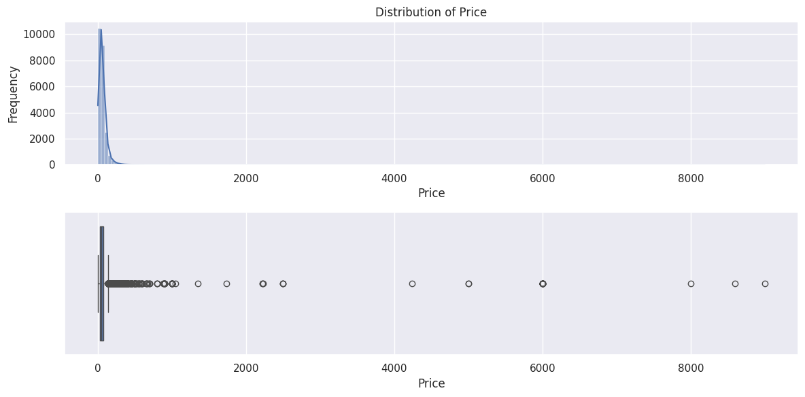
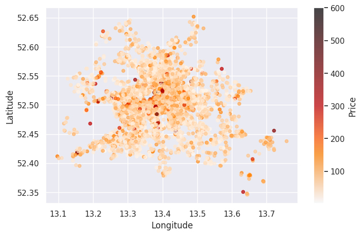
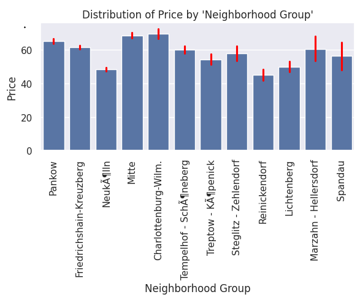
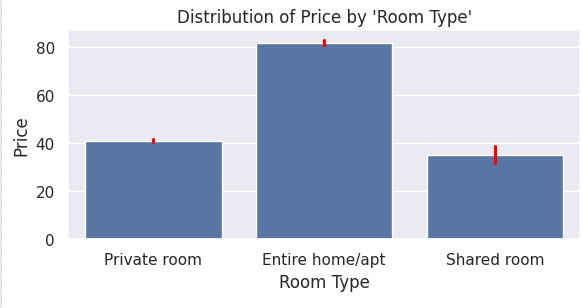
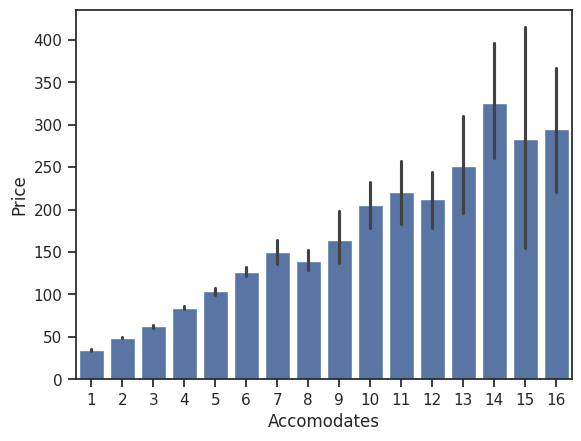
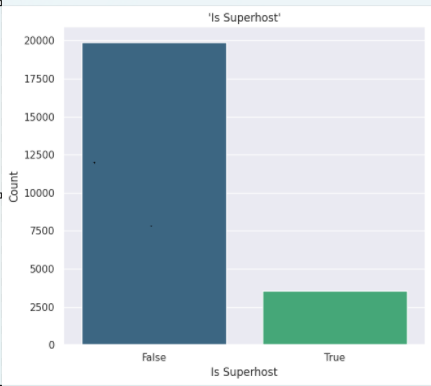
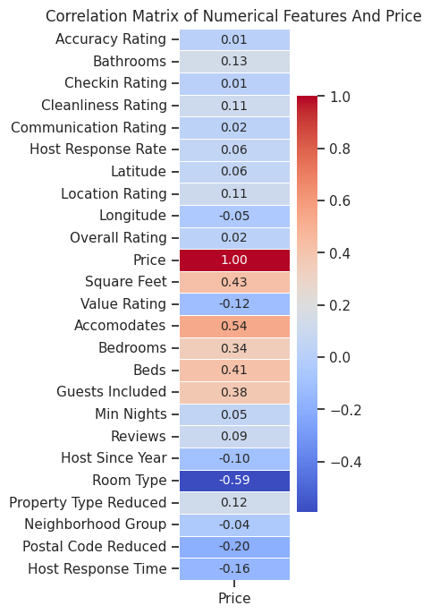
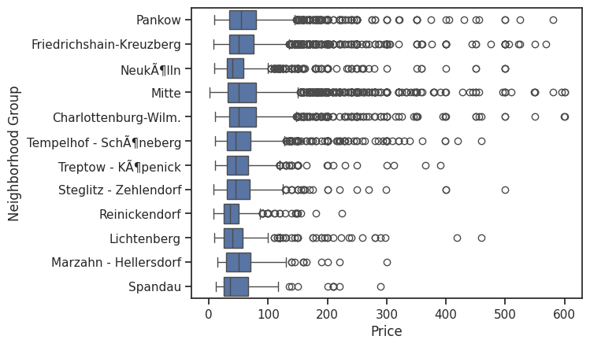
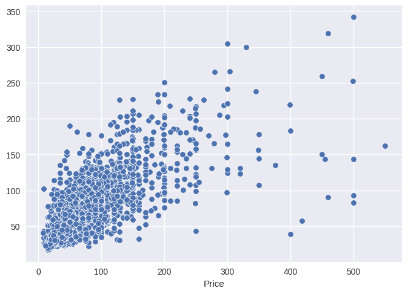

# 🧠 Price Prediction of Berlin Airbnb accommodation

Airbnb is a global online marketplace that connects people looking for accommodations with hosts who have spaces to rent. It operates through both a website and a mobile application, making it easy for travelers to find short-term rentals, vacation homes, and even experiences offered by locals. 
Airbnb enables people to rent out their properties, apartments, or even shared spaces to travelers looking for accommodation. It operates through a website (www.airbnb.com) and a mobile app

## Key Features of Airbnb
- Search and Booking – Users can search for accommodations based on location, price, type, and amenities.
- Filters and Categories – Listings are categorized by type (e.g., entire home, private room, shared room).
- Reviews and Ratings – Travelers can check ratings and reviews from previous guests.
- Secure Payments – Airbnb provides a secure payment system to protect both guests and hosts.

## Project Goal
The objective of this project is to predict the price of accommodations based on a summary of available features.

---

## 📂 Table of Contents
- [Overview](#overview)
- [Model Details](#model-details)
- [Project Structure](#project-structure)
- [Installation](#installation)
- [Usage](#usage)
- [Results](#results)
- [Contributing](#contributing)

---

## 📌 Overview

This dataset provides detailed information on Airbnb listings in Berlin, including reviewer ratings and guest comments. It enables exploration of property characteristics, host profiles, and guest experiences in the German capital.

This project aims to predict the price of accommodations based on a summary of available features.  
It uses Python and various machine learning libraries to _(summary of methodology or techniques used)_.

**Problem Type:** Regression 

**Main Objective:** Predict Airbnb rental prices based on property Accommodates, location, Room Type and Property Type and more features.

The project is written in Python and contain the following notebooks and stages:
- **01_Airbnb_Berlin_Data_Preparation**
  - Import dataset and aggregate dataset by Listing ID
  - Inspection: descriptive, statistics info and missing values
  - Identify data types - categories, numbers and objects
  - Pre-cleaning - If a categorical column is not relevant to the analysis, we can remove it
    - Reduce Large Categories
    - Transform/Manipulate data ('instant_bookable' data into bool)
  - Export dataset for next stage
- **02_Airbnb_Berlin_EDA (Explanatory Data Analysis)**
  - Location vs Price and Room Type and Property type vs Price
  - Price Differences on a minimum_nights, number_of_reviews, reviews_per_month, and availability_365
  - Correlations between reviews
  - Detect and handle outliers using inter-quartile range (IQR)
  - Detect and handle missing values using KNN model
- **03_Airbnb_Berlin_Feature_Engineering**
  - Transfer 'latitude' and 'longitude' to the 'distance' from center
  - Extracting years from date columns like 'Host Since' 
  - Final check and export dataset for next stage
- **04_Airbnb_Berlin_Feature_Selection**
  - Multivariable Analysis using LASSO, Ridge, GradientBoosting and Random Forest
  - Summarization and Selection of Variables
  - Final check and export dataset for next stage
- **05_Airbnb_Berlin_Model_selection_Finetuning**: Training different models, tuning hyper-parameters and studying Model performance 
  - Apply regression models
  - Hyperparameters and Finetuning
  - Model Evaluation
  - Conclusions and best Model selected

---

### Explanatory Data Analysis

The next step in the analysis is visualizing the data. This was interesting because I wanted to see the patterns and trends of the relationship between different independent variables and between dependent and independent variables.
First I started with the target value distribution and statistics to identify extreme outliers 


The description of price shows that 75% of the room only charged within 70€. But we can find the maximized price is extremely large - up to 9000€.

We can also have scatter plot to show how price distributed by geolocation (Latitude and Longitude)



In addition, we can explore the average price offered with different neighborhoods or by Room Type.





I also wanted to check how the average price remains when the number of accommodates comes into picture. By intuition, we know that as we increase the number of accommodates while renting out a house, the price automatically increases. Let’s see if this is true in this case too.



Looks like it is. Also, I can check whether a host is a super host or not, and if this contributes in a way on how the price might get affected or influenced. Fig 4 indicates the count whether a host was a superhost or not. ‘0’ indicates the absence of superhost title and ‘1’ indicates as true



Along with the Exploratory analysis, I have also dealt with some statistical inference questions on what features or variables have a good correlation with the target variable. For this, I have calculated the Spearman Correlation



This is an interesting calculation at hand here, because the relationship between different variables can be calculated which proves an important factor in building our model later on.

Besides this, I also wanted to check how the mean price varies for different neighborhoods, and how many outliers are present, so that I get a clear picture how the data is. This is done by a box plot



---
### Model selection and Fine-tuning
Now comes the part where the models will be trained, now that the data acquired is wrangled properly and brought to the same format. 
Since, this is for predicting the price, which is a continuous variable, I have used Regression models for this project such as Random Forest Regressor, Adaptive Boosting (ADABoost) and XGBoost. 

The Training and Testing data have been split into 80% and 20%(a cross validation technique explained next) respectively using Machine Learning ‘sci-kit’ library.

*italic Just a note here that I have also used a technique of ‘Label Encoding’ where I have changed the categorical columns to numeric columns, since Machine Learning algorithms can only predict on numeric data.*

Mainly, I have used almost all the features from the sub DataFrame(just to remind, a set of features have been extracted into a separate one for analysis) to predict our dependent variable, price. This is a supervised learning technique since our target variable has been labelled and could used for mapping input-output pairs.

---
#### 🧪 Model Details

- **Algorithm(s):** Linear Regression, Decision Tree Regressor, Random Forest, Gradient Boosting Machine (GBM),Adaptive Boosting (ADABoost), and XGBoost.
- **Evaluation Metrics:** RMSE, MAE, R² Score
- **Features Used:** "Guests Included","Room Type","Bedrooms","Accomodates","Cleanliness Rating","Location Rating","Value Rating","Property Type Reduced","Distance From Center","Reviews","Beds","Host Since From Now"

---
#### 📊 Results

The best Model we got before any tuning was XGBoost with MAE=18.94 and R²=0.52

| Model            |    MAE    |     MSE      |   RMSE    |   RMSLE   |    R²     |
|:-----------------|:---------:|:------------:|:---------:|:---------:|:---------:|
| XGBoost          | 18.943212 | 1072.720485  | 32.752412 | 0.391233  | 0.523833  |
| GBM              | 19.182484 | 1071.343460  | 32.731383 | 0.393951  | 0.524444  |
| RandomForest     | 19.487438 | 1103.768108  | 33.223006 | 0.402343  | 0.510051  |
| LinearRegression | 21.611289 | 1316.465641  | 36.283132 | 0.463381  | 0.415637  |
| DecisionTree     | 26.788363 | 2431.391091  | 49.309138 | 0.539322  | -0.079264 |
| SVR              | 27.265245 | 2263.359686  | 47.574780 | 0.554178  | -0.004677 |
| ADABoost         | 28.698045 | 1793.594578  | 42.350851 | 0.552306  | 0.203846  |

---
#### 🛠️ Hyperparameters and Fine-tuning

The best Model we got with improvement of 5.52%, after tuning using **RandomizedSearchCV(estimator=model_RFR, param_distributions=lighter_grid, n_iter=25, cv=3,
verbose=2, random_state=42, n_jobs=-1)** was **RandomForestRegressor(bootstrap=False, max_depth=30, max_features='sqrt',
min_samples_split=5, n_estimators=300, random_state=42)**

| model              | MAE       | MSE         |  RMSE     | RMSLE    | R²       |
|--------------------|-----------|-------------|-----------|----------|----------|
| Tuned_RandomForest | 18.464568 | 1018.055651 | 31.906984 | 0.383515 | 0.548098 |

Summary of model performance:
- Validation MAE: 15.45
- Validation RMSE: 31.9
- Test R² Score: 0.548


**scatterplot of best/tuned Random Forest model between y_valid and Y_predict**



---
## 🏗️ Project Structure

```
project-name/
│
├── content/            # Raw and processed datasets
├── notebooks/          # Jupyter notebooks for EDA and model development
├── models/             # Trained models and serialized files
├── src/                # Core scripts: preprocessing, training, evaluation
│   ├── preprocess.py   # missing
│   ├── train.py        # missing
│   └── evaluate.py     # missing
├── requirements.txt    # Python dependencies
├── README.md           # Project documentation
└── pyproject.toml      # Project dependencies and settings
|__ poetry.lock         
```

---
## 🚀 Getting Started

Instructions to get a copy of the project running locally.

### Prerequisites

- Download [Airbnb Berlin.csv](https://www.kaggle.com/datasets/thedevastator/berlin-airbnb-ratings-how-hosts-measure-up/data)
- Install python
  
## ⚙️ Installation

Clone the repository:
```bash
git clone https://github.com/hajyhia/Airbnb_Berlin_Price_predic.git
cd Airbnb_Berlin_Price_predic
```

Create a virtual environment and install dependencies:
```bash
python -m venv venv
source venv/bin/activate   # On Windows: venv\Scripts\activate
pip install -r requirements.txt
```

---

## 🚀 Usage

Run data preprocessing:
```bash
python src/preprocess.py
```

Train the model:
```bash
python src/train.py
```

Evaluate performance:
```bash
python src/evaluate.py
```

---

## Websites
- https://www.kaggle.com/
- https://www.airbnb.com/
---

## 🤝 Contributing

Contributions are welcome! Please open an issue or submit a pull request.

---
